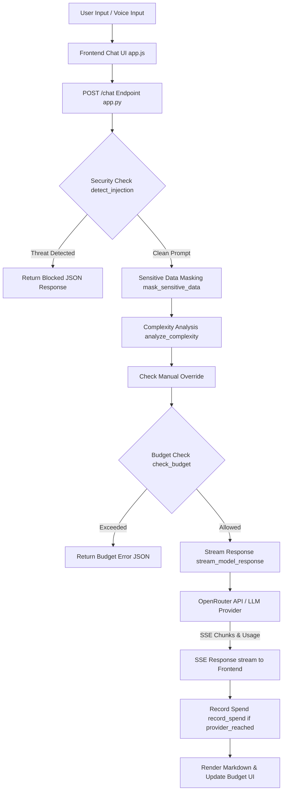

# ⚡ Otari – Cost-Aware AI Assistant

> **HackArena 2.0 Grand Finale** | **Mozilla.ai Track** | **Team: procastiNOTers**

Otari is an intelligent, cost-aware AI assistant that dynamically routes incoming user queries to appropriate LLM complexity tiers, balancing output quality against cost and latency.

---

## 📋 Table of Contents

- [Project Overview](#-project-overview)
- [Key Features](#-key-features)
- [Architecture & Request Workflow](#-architecture--request-workflow)
- [Model Routing Matrix](#-model-routing-matrix)
- [Tech Stack](#-tech-stack)
- [Folder Structure](#-folder-structure)
- [Installation](#-installation)
- [Environment Variables](#-environment-variables)
- [Usage Examples](#-usage-examples)
- [API Endpoints](#-api-endpoints)
- [Cost & Budget Accounting Logic](#-cost--budget-accounting-logic)
- [Testing](#-testing)
- [Known Limitations](#-known-limitations)
- [Future Improvements](#-future-improvements)
- [Contributing](#-contributing)
- [License](#-license)
- [Authors](#-authors)

---

## 🚀 Project Overview

Most AI applications blindly send every user prompt to high-cost, heavyweight models, consuming unnecessary budget for simple factual questions or greetings. 

**Otari** solves this efficiency gap by analyzing each prompt before execution. It evaluates technical complexity, requested intent, multi-step requirements, and security risks, routing the query to the most appropriate free or cost-effective model tier in real time.

---

## ✨ Key Features

- 🧠 **Dynamic Complexity Classification & Routing**  
  Automated keyword and domain concept classifier that evaluates query depth and routes requests to Simple, Medium, or Complex model tiers.
- 💰 **Authoritative Local Budget Meter**  
  Tracks request costs against a local budget (default `$2.0000`), clamping remaining budget to non-negative values.
- 📊 **Triple Cost Accounting**  
  Distinguishes between actual **Provider Cost** (`$0.0000` for free models), **Tier Estimate Cost**, and **Billed Cost**.
- 🔤 **Real Token Usage Metrics**  
  Extracts exact `prompt_tokens`, `completion_tokens`, and `total_tokens` directly from provider API responses.
- 📝 **Live Token Streaming & Markdown Rendering**  
  Streams responses token-by-token using Server-Sent Events (SSE) and renders formatted HTML (headings, bold, lists, fenced code blocks, tables) via `marked.js`.
- 🛡️ **Security & Privacy Guardrails**  
  Fast-path injection attack detector with risk scoring (`0–100`) and automated PII masking.
- 🎙️ **Voice Integration (STT & TTS)**  
  Speech-to-Text transcription (`Pulse` model) and Text-to-Speech audio playback (`Lightning` model) powered by Smallest AI.
- 🎛️ **Manual Model Override**  
  Allows users to manually force `Fast`, `Balanced`, or `Pro` tiers via UI dropdown.
- 🔬 **Interactive Route Simulator & Dashboard**  
  Dry-run prompt complexity scoring and view request logs in real time.
- 🌙 **Dark & Light Theme Toggle**  
  UI theme toggle with `localStorage` preference persistence.

---

## 🏗️ Architecture & Request Workflow



### Execution Flow Steps:
1. **Security Inspection**: Prompt checked against injection patterns; returns fast 200 JSON block if threat score exceeds threshold.
2. **PII Masking**: Sensitive tokens (emails, keys, credit cards) masked prior to sending to LLM.
3. **Complexity Scoring**: Prompt evaluated for technical domain terms, multi-word phrases, intent, and multi-step conjunctions.
4. **Budget Verification**: Checks if local remaining budget can cover tier base cost.
5. **Streaming Execution**: `requests.post(..., stream=True)` opens SSE connection with `utf-8` encoding.
6. **Spend Recording**: Budget is deducted **only** if `provider_reached = true`. Failed provider calls charge `$0.00`.

---

## 🎯 Model Routing Matrix

| Tier Level | Complexity Score | OpenRouter Model Slug | Tier Est. Cost | Max Tokens | Output Strategy |
| :--- | :---: | :--- | :---: | :---: | :--- |
| **Simple** | `0 – 29` | `nvidia/nemotron-3.5-lightning:free` | `$0.0010` | `250` | Direct, concise answers (2–6 sentences) |
| **Medium** | `30 – 64` | `dots-studio/dots-3-note-preview:free` | `$0.0030` | `600` | Structured explanations with examples |
| **Complex** | `65 – 100` | `nvidia/nemotron-3-ultra-550b-a55b:free` | `$0.0080` | `1500` | Deep technical breakdown & architecture steps |

---

## 🛠️ Tech Stack

- **Backend Framework**: Python 3.10+, Flask 2.3+, Flask-CORS 4.0+
- **HTTP & Streaming**: `requests` (with SSE stream-with-context & `utf-8` stream handling)
- **Frontend Layer**: Vanilla HTML5, CSS3 (CSS Custom Properties), JavaScript (ES6+ Native Fetch & EventStreams)
- **Markdown Parsing**: `marked.js` (via CDN)
- **AI / LLM Gateway**: OpenRouter API (`https://openrouter.ai/api/v1`)
- **Voice Services**: Smallest AI (`Waves API` for STT & TTS)

---

## 📁 Folder Structure

```text
otari-cost-aware-assistant/
├── backend/
│   ├── app.py           # Core Flask web server, SSE streaming & API routes
│   ├── budget.py        # Local budget ledger, clamp math & spend tracking
│   ├── complexity.py    # Domain keyword & multi-step complexity scoring engine
│   ├── router.py        # Model tier mapping helper
│   ├── security.py      # Prompt injection detector & PII masking engine
│   └── requirements.txt # Python package dependencies
├── frontend/
│   ├── index.html       # Single Page Application HTML shell
│   ├── app.js           # Frontend state, SSE reader, Marked parser & details grid
│   └── style.css        # Responsive layout, dark/light themes & Markdown styling
├── .env.example         # Template environment configuration
├── .gitignore           # Git ignore manifest (protects backend/.env)
└── README.md            # Technical documentation
```

---

## ⚙️ Installation

### 1. Prerequisites
- **Git**
- **Python 3.10+** (with `pip`)

### 2. Clone Repository
```bash
git clone https://github.com/GavaraNeha/otari-cost-aware-assistant.git
cd otari-cost-aware-assistant
```

### 3. Install Backend Dependencies
```bash
cd backend
pip install -r requirements.txt
```

---

## 🔑 Environment Variables

Copy `.env.example` to `backend/.env`:
```bash
cp ../.env.example backend/.env
```

Configure your API keys inside `backend/.env`:
```env
# Smallest AI Voice Configuration (Optional for Voice Features)
SMALLEST_API_KEY=sk_bdf6d74c56829bc19603fc02ee1a9f9d
SMALLEST_TTS_URL=https://api.smallest.ai/waves/v1/tts
SMALLEST_STT_URL=https://api.smallest.ai/waves/v1/stt/?model=pulse&language=en

# LLM Provider Configuration
LLM_PROVIDER=openrouter
LLM_API_KEY=your_openrouter_api_key_here
LLM_BASE_URL=https://openrouter.ai/api/v1
LLM_MODEL=meta-llama/llama-3.2-3b-instruct:free
LLM_MAX_TOKENS=800
LLM_TEMPERATURE=0.3
```

> ⚠️ **Security Note**: Never commit `backend/.env` to source control. It is untracked by `.gitignore`.

---

## 🚀 Running the Application

From the `backend` directory, start the Flask server:
```bash
python app.py
```

Open your web browser and navigate to:
**[http://localhost:5000](http://localhost:5000)**

---

## 💡 Usage Examples

### 1. Web Chat Interface
- Type a simple prompt like `"hello"` or `"what is python"` -> Routes to **Simple Tier**.
- Type a conceptual question like `"explain data structures"` -> Routes to **Medium Tier**.
- Type an engineering query like `"design a distributed compiler architecture"` -> Routes to **Complex Tier**.
- Click **▸ Response details** under any bot message to inspect exact model, tokens, latency, and cost metadata.

### 2. cURL Chat Request (Streaming SSE)
```bash
curl -N -X POST http://127.0.0.1:5000/chat \
  -H "Content-Type: application/json" \
  -d '{"message": "explain stacks"}'
```

---

## 📡 API Endpoints

| Endpoint | Method | Description | Content-Type |
| :--- | :---: | :--- | :--- |
| `/` | `GET` | Serves main frontend `index.html` | `text/html` |
| `/chat` | `POST` | Processes chat prompt; streams response or returns JSON block | `text/event-stream; charset=utf-8` or `application/json` |
| `/stats` | `GET` | Returns budget summary, total spent, and request history log | `application/json` |
| `/health` | `GET` | Service status and version check | `application/json` |
| `/api/tts` | `POST` | Converts text string to audio binary | `audio/wav` |
| `/api/stt` | `POST` | Transcribes uploaded audio binary into transcript string | `application/json` |

---

## 💰 Cost & Budget Accounting Logic

1. **Authoritative Budget**: Maintained locally in `backend/budget.py` initialized at `$2.0000`.
2. **Clamped Budget Calculation**: `remaining = max(0.0, INITIAL_BUDGET - total_spent)` prevents budget from becoming negative.
3. **Provider Cost vs. Billed Cost**:
   - `provider_cost`: Real usage cost returned in OpenRouter API response (`$0.0000` for free tier models).
   - `estimated_cost`: Tier base estimate (`$0.0010`, `$0.0030`, `$0.0080`).
   - `cost` (Billed): Deducted from user budget **only when provider API call succeeds** (`provider_reached = true`).
4. **Failure Guarantee**: On network error or HTTP API failure (`provider_reached = false`), `billed_cost = $0.0000`, `total_tokens = 0`, `model_used = null`, and user budget remains unchanged.

---

## 🧪 Testing

Test script `backend/test_all_requests.py` can be executed against a running server to verify live tier routing, UTF-8 streaming, token tracking, and failure handling:

```bash
cd backend
python test_all_requests.py
```

---

## ⚠️ Known Limitations

- **Upstream OpenRouter Queue Delays**: Free tier models on OpenRouter may experience variable Time-To-First-Token (TTFT) depending on provider traffic.
- **In-Memory Budget Persistence**: Current budget state resets when the Flask server process restarts.
- **Voice Feature Dependency**: Voice recording (STT) and playback (TTS) require an active Smallest AI API key.

---

## 🔮 Future Improvements

- [ ] Persistent database storage for budget balance and audit logs (PostgreSQL / SQLite).
- [ ] User authentication & per-user budget quotas.
- [ ] Support for custom local model providers (Ollama / LocalAI).
- [ ] Automated Fallback model fallback hierarchy per tier.

---

## 👥 Authors & Acknowledgments

**Team procastiNOTers** — HackArena 2.0 Grand Finale (Mozilla.ai Track)
- **Gavara Neha**
- **Gundu Iswarya Lakshmi**
- **Ganesam Parthasaradhi Reddy**
- **Vanka Namratha Amanigreeva**

*Developed for HackArena 2.0 at IIIT Delhi, June 2026.*
